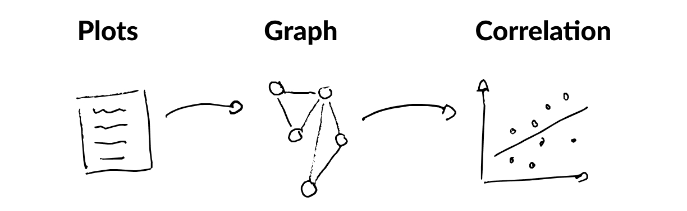
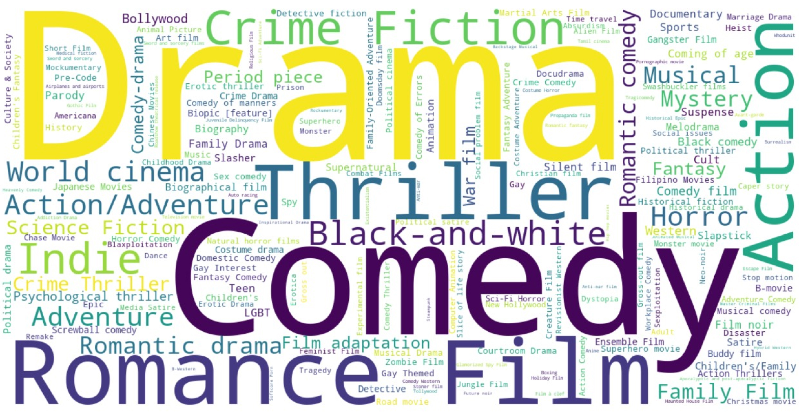

# Creative breakthroughs occur, when worlds collide

*Thai-Nam Hoang, Valentin Peyron, Paul-Bogdan Jurcut, Quentin Esteban, Jan Kokla*

	
	 

		
Below, you'll find some graphs that take almost the full window width.

        
If you have problem scrolling, move your mouse to the side of the screen.

	

In 2004, American entrepreneur Frans Johansson published the book
[“The Medici Effect: Breakthrough Insights at the Intersection of
Ideas, Concepts, and Cultures”](https://www.goodreads.com/pt/book/show/20482413). 
In other words, by merging ideas from a range of diverse backgrounds,
one can increase the likelihood of intellectual cross-pollination,
which might lead to innovation and success. Our goal is to see if this 
holds true in the movie industry.

## How?

We use the data about the movies, mainly their genres and plots to 
generate graphs that help us to quantify 
"being at the intersection", which will later be used in correlation analysis. 
This is the high-level idea, let's now go to details.

    

## "At the intersection"?

Before we can dive deep into the movies, we need to first think about the 
concept of “being at the intersection” for a second. Most natural way 
of looking at it is network graphs. With 2 simple examples, we will 
introduce the two measures that we’re going to use 
for quantifying it: **_degree_** and **_betweenness_**.

### Betweenness

If you take a look at the graph below, you see that we have 2 bigger 
clusters and one node that sits at the intersection. 
This is exactly what the Medici effect referred to! The yellow node in the middle 
is a combination of the ideas from both clusters or controls the flow of information 
and according to the theory should be more successful. Visually it all looks 
really simple to grasp right, but how can we quantify it? This is where 
**betweenness** measure comes in.



If you take all pairs of nodes from the graph and find the shortest paths 
between them, then betweenness centrality for a certain node is _the percentage 
of these shortest paths that go through the node_. If you now once again look 
at the graph above and focus on the colors of the nodes, you see 
that the lighter the color, the bigger the betweenness (hover over the nodes). We have 
successfully quantified “being at the intersection” for clustered network graphs.

### Degree

What if we don’t have such clear clusters, but rather have a big chunk of quite 
similar movies and then some outliers as seen from the graph below? We don’t really 
have nodes that act as bridges between clusters and sit at the intersections. In 
that case, let’s redefine the Medici effect in the movie industry a bit and say 
that the most successful movies will be **the ones that have taken ideas from many 
other movies and thus are connected to the biggest possible number of other nodes**. 
You might already have guessed… degree of the node is exactly what we need.



The degree of a node is the number of connections that it has to other nodes in the 
network. This time, the color of the node reflects exactly that 
(lighter color 
means higher degree). If you hover over the nodes, you can compare the betweenness 
and degree measures for the node. Naturally, the ones in the big cluster have higher 
degree, compared to the ones in the outskirts.

## Data

Now that we have the theory settled, let's look at the data. We used 
[CMU Movie Summary Corpus](https://www.cs.cmu.edu/~ark/personas/) 
that contains the release year, name and plot descriptions. 
From the histogram below, we can see that there is a considerable amount of movies. 
To cope with such quantities, we decided to run the analysis on decade basis. 
In other words, all the correlation analyses below are done for 10 years: 1920-1929, 
1930-1939 etc. As visualising even 1000 nodes would be computationally heavy, all 
the following graphs use year 2012 as an example (388 nodes).



We have already talked a lot about the "success" of a movie. In this analysis we decided to 
use IMDB rating as the proxy for it. We used freely accessible 
[IMDB ratings](https://developer.imdb.com/non-commercial-datasets/) and merged it with the existing data. Below you see that 
ratings are nicely distributed and mostly between 4 and 8. This is good to 
keep in mind when performing correlation analysis - one of the arguments is 
almost normally distributed and if it so for the other variable, we can use parametric 
methods.



## What about the movies?

We have found ways for quantifying the centrality of the node, but how about movies? 
There must be a way of representing our big corpus of data as graphs so that we could 
calculate the metrics we discussed above and measure their correlation with IMDB ratings. 
For that we came up with three 
alternative approaches, which include **embeddings** and **genres**.

### Embeddings

The idea is simple: find the similarity between all possible combinations of movies 
and if they're similar enough, create an edge. The reality is a bit more complex.
We first need to turn movies into vector representations. In order to do that, 
we'll use an embedding model 
[E5-large-v2](https://huggingface.co/intfloat/e5-large-v2) that takes the plot of 
the movie as an input and converts it into normalized feature vector with 
embedding size of 1024.

Once we have vectorized the plots and as they're normalized, we can calculate 
the cosine similarities between the plots with dot product. Below 
you can see an example of similarity matrix with 20 random movies. Notice that 
one of the quirks of the embedding model is that all the cosine similarities are
between 0.7 and 1.0. As we still have a distribution, it will not be a problem for
us.



Let's make a sanity check and take a look at the similarity matrix to see 
if it intuitively makes sense.
[_Sortie 67_](https://www.imdb.com/title/tt1651916/) and 
[_Victim_](https://s.media-imdb.com/title/tt1684564/?ref_=nm_flmg_t_1_msdp) 
both talk about witnessing a brutal murder, so it makes sense to qualify them as 
similar. On the other hand, 
[_How to Start a Revolution_](https://www.imdb.com/title/tt1956516/) is not
too similar to any other movie. This is expected as it's a biographical 
documentary, whereas all the others are based on fiction. It is especially different 
from [_Rabbit Hole_](https://www.imdb.com/title/tt0935075/?ref_=nv_sr_srsg_3_tt_7_nm_1_q_rabbit%2520h),
which talks about a happy couple whose life is turned upside down after their young 
son dies in an accident. Thus, it seems that the embedding model has bone a decent 
job.

Once we have the similarity matrix, we need to figure out the **threshold** for the 
similarities. We want to create an edge between all the movies for which the 
similarity is higher than the number we pick. [_How to Start a Revolution_](https://www.imdb.com/title/tt1956516/)
from the similarity matrix, for example, will not have too many connected movies. 
In order to come up with threshold, let's look at the histogram of the similarities below.



The values are normally distributed and in order to keep it simple, let's set the limit for creating 
as edge to 75% percentile. We have finally reached the goal... we have a graph. 
For better visibility, the one below only includes the movies from 2012. For the first graph, 
we use really simple approach, where the size of the node is constant and the color 
depicts the rating (**lighter color → higher rating**).

	
	 

		
Hover over the nodes to see attributes and click on it to see its neighbours.

        
Feel free to drag, zoom and filter based on IMDB rating.

	



As we have only one big cluster, then the question to ask when coming back to 
to the research problem is "whether the movies with higher degree are more successful". 
In other words, we should see that the lighter nodes tend to be at the centre of the graph. 
From the visual inspection it is really hard to tell if that's the case.
If anything, it might be that the movies with the worst ratings (dark purple) are more 
central, which would turn the logic of the theory upside down - better connectivity means 
lower rating.

### Genres

Before we get to correlations, let's see another approach for generating network 
graphs. We first use the genres provided in the dataset and them apply a custom 
approach for more robust results.

#### Raw Genres

As every movie has one or several genres associated with it, we can use it 
to form a graph: **there will be an edge between the movies, if they have at least 
one common genre**. Now it's getting interesting as we're using exactly the same movies to generate the graph, 
but it looks completely different from the first one. When in the first case, the color represented 
the rating, then this time we have used betweenness instead... 
or logarithm of betweenness to be precise to get better variability of colors. 
The size of the node now depends on the rating. As you 
can see, there are some really distinct clusters where betweenness is 0, but again 
no clear pattern of size-color dynamics that we're searching for.



#### Genres & Themes

"Who came up with those genres?" you might ask, and you're right. Do you know what 
is [gloat gland](https://en.wikipedia.org/wiki/Goat_gland_(filmmaking)) or why should 
we have a genre named "The Netherlands in World War II"? 

    

Some genres, such as 
"Black-and-white" or "Animation," do not directly relate to the plot but rather to the 
style or technique of the movie. The presence of subgenres like "Romantic Drama" complicates 
the situation, as they often represent a mixture of primary genres, 
<u>making it difficult to maintain clear distinctions</u>. Even among the most popular genres,
we observe unnecessary entanglement. For instance, while "Comedy" and "Drama" are distinct 
in the emotions they evoke, genres like "Science-Fiction" or "Crime" often overlap with 
others such as "Drama" and "Comedy," serving more as settings or themes rather than standalone genres.



To enhance the accuracy of our movie classification, we've decided to differentiate between 
"**genres**" and "**themes**". This distinction allows us to capture both the emotional 
tone and the narrative setting of each movie more effectively. This way we can get more nuanced 
classification.



Why all this fuss? Now we can use another fancy 
[Large Language Model (LLM)](https://huggingface.co/facebook/bart-large-mnli) to predict the probability
of belonging to a certain genre and a certain theme. We let the model predict genres and themes separately, 
so we get two vectors with 8 elements that both sum up to 1. As an example, let's look at 
[_Life of Pi_](https://www.imdb.com/title/tt0454876/) and see if the probabilities make sense to the naked eye. 
First, only genres:

~~~ json
{
    "Adventure": 0.3571245074272156, 
    "Action": 0.12947343289852142, 
    "Drama": 0.12647315859794617, 
    "Documentary": 0.11648714542388916, 
    "Horror": 0.09885319322347641, 
    "Thriller": 0.06726425886154175, 
    "Romance": 0.06251280009746552, 
    "Comedy": 0.04181152954697609
} 
~~~

_Life of Pi_ is far from comedy and rather adventurous with some action and drama... makes sense. 
What about themes:

~~~ json
{
    "Fantasy": 0.25475648045539856, 
    "Science-Fiction": 0.16728335618972778, 
    "History": 0.13641420006752014, 
    "Family": 0.09733916819095612, 
    "Western": 0.0917028859257698, 
    "Mystery": 0.08793745934963226, 
    "Crime": 0.0848972499370575, 
    "War": 0.07966917008161545
} 
~~~

If Life of Pi is something from these themes, then it will probably be fantasy, 
so the model was once again successful.

We can now concatenate the two vectors with probabilities, normalize it to unit vector 
and then we have a feature vector once again for every movie. When the first 
embedding approach gave us an embedding of size 1024 and all those numbers didn't tell us anything, 
then this time we have interpretable values in the feature vector. As with previous approach we find all possible
similarity combinations, set the threshold to 75th percentile and 
create an edge every time similarity is higher than the threshold.



Once again we have a different graph from the same movies. As with previous graph, 
the color of the node is logarithm of betweenness (lighter color → higher measure) and size illustrates 
the IMDB rating. While in previous graphs, the betweenness was either really high or almost zero, then this 
time we have better spread due to the methodology we applied. Visually, however it is again impossible 
to say if there is any relationship between the size and color of the node. It's high time for 
correlation analysis.

## Correlation Analysis

To recap, we have generated the graphs in three different ways, and analysed 
the relationships between the centrality measures and success (IMDB rating) 
visually, which didn't tell us anything conclusive. Hopefully, correlation analysis 
will shed some more light. Although we have three graphs, we used two different measures to 
quantify the effect of "being at the intersection" and can therefore have more combinations. 
Due to the limitations of some of the approaches we confine with the following relationships:

1. **embedding approach**: rating vs degree
2. **raw genre approach**: rating vs betweenness
3. **genre & theme approach**: rating vs degree
4. **genre & theme approach**: rating vs betweenness

The most popular correlation measure, **Pearson's correlation coefficient**, is really sensitive to 
outliers, which is why we plotted the distributions of the variables below. Betweenness measures 
clearly follow the power law and are not suitable for using Pearson's correlation. The same applies to 
degree of "genres & themes" that has long tail. Thus, we will use **Spearman's rank correlation** for these 
three, as it is invariant to the outliers.



### So, is there a relationship?

To answer the question, let's look at it once again visually using scatterplots with regression lines. 
The plots only quantify the association between the degree and the IMDB rating 
of the nodes using the "embedding approach" for generating the graph. As you can see,
the regression lines are only slightly tilted indicating that the correlation 
between the degree and IMDB rating is very weak. What is interesting, however, is 
that all decades, without any exception, have small **negative** correlation. In 
other words, it might mean that <u>"being at the intersection" or trying to take ideas from 
many other movies is counterproductive as it is associated with lower rating from 
the viewers </u>.



How about other approaches? The table below summarises the results with corresponding p-values 
in brackets. All the other approaches, however, show the very weak **positive** correlation. 
The coefficients are so small that it might be due to chance and the way we generated the graph.



### That's too easy!

Simple correlation might not give us too clear picture though as there are some 
other variables that might influence the association. For example: 

1. we know that **some movies have more ratings than others**;
2. **country of origin** might influence the IMDB ratings;
3. IMDB rating might also be depending on the **genres** of the movie.

Let's use partial correlation and "control" for such variables. 



What happened when we removed the effect of the amount of ratings? Although, the mix 
of positive and negative correlations is now more confusing, the general picture became much more clear - 
**there is no linear dependency between "being at the intersection" and IMDB ratings**. 
The coefficients are so small that there is no doubt it is due to noise rather than 
anything else. When coming back to the original question "are movies that merge ideas 
from different genres/domains more successful", we can say that based on the used approaches, 
there is no such relation.

## Summary

Our story started with the "Medici effect", the idea that different 
perspectives could increase the originality and lead to better outcome. 
We applied the idea to the movie industry and hypothesised that movies with 
different genres/ideas/motives would be more successful. To validate it, we converted 
the raw data of the movies into graphs using different approaches for more robustness. 
Based on graphs we calculated the measure of "being at the intersection", which 
we represented with betweenness and degree centrality. Finally, we calculated 
correlation and controlled for some variables for further robustness.

What can we conclude? Three different approaches told us contradicting stories, but after 
controlling for confounders, we can conclude that there isn't any evidence that 
merging ideas from different genres/domains could help with the popularity or success of 
a movie. The patterns we observed are likely due to random chance rather than a systematic association. 
What is more, we saw that the results highly depend on the approach we used for modelling 
the data, which is to be expected as we went from plot descriptions into graph representations, which is not 
too straightforward.

Lastly, it's important to watch out for something called publication bias and a sneaky 
practice known as [p-hacking](https://en.wikipedia.org/wiki/Data_dredging). 
Imagine if we had only chosen one of the graphs in the end and only told the 
story that suits us best. It might seem tempting, especially when the sample size 
is large enough to show a statistically significant effect. However, we resisted 
that temptation and made sure to present all our findings, not just the ones 
that stood out. This honesty is crucial to maintain the credibility and transparency 
of the research, avoiding any shortcuts that might make our results seem more 
impressive than they really are.

## Ethical Risks

We used [Digital Ethics Canvas](https://www.epfl.ch/education/educational-initiatives/cede/training-and-support/digital-ethics/a-visual-tool-for-assessing-ethical-risks/the-digital-ethics-canvas-how-to/)
to assess the risks related to the project. It aims to determine if the best movies are at 
the "intersection of different genres" and the worst outcome could stem from bad methodology 
and inaccurate results. However, let's conduct a more in-depth analysis of our project from an 
ethical standpoint to identify potential risks and explore mitigation 
strategies.

	
	 

		
This analysis was conducted at the end of our work, 
so none of the proposed measures have been implemented yet.

	

#### Dataset 

Firstly, let's examine the dataset. It was created by a team at 
Carnegie Mellon University and consists of 42,306 movie plot 
summaries extracted from Wikipedia, along with aligned metadata 
from Freebase. Therefore, the data was sourced from public domains. 
We supplemented this dataset with IMDb ratings and vote counts 
from a public database. Data gaps were not addressed in our study.

#### Beneficence

Our project offers insights into cinematic trends and 
contributes to understanding the factors behind the success of a movie. 
Specifically, it explores whether using motives from several 
genres could be beneficial for a movie.

#### Non-Maleficence

Incorrect results from our study could potentially lead to misguided decisions 
in movie production, affecting ratings and possibly the financial success of the involved parties. 
However, since our analysis is based solely on ratings, financial implications are uncertain.

To reduce these risks, we could cross-reference our data with another dataset to increase 
the robustness of our results. Performing multiple analyses with the same goal and 
comparing them could also be beneficial, which we did by using various metrics to define "being at the intersection".

#### Privacy

As the data used is completely anonymous, there are no privacy concerns with our dataset.

#### Fairness

From a human fairness perspective, our study did not use data related to actors or characters, 
thus eliminating human-related fairness risks. However, a minor fairness issue might arise from 
the genres of movies, as our analysis includes genre information, potentially leading to skewed 
results due to genre distribution imbalances.

To mitigate the risk, it would be useful to ensure a balanced representation of genres. 
This has been done by "controlling" for genres in the correlation analysis.

#### Sustainability 

Our project requires quite a big computational load, which spends significant amount of 
energy. It is up to discussion if the results provided by this analysis outweigh the 
energy consumption. We could make sure that the servers provided for us run on sustainable energy.

#### Empowerment

Our analysis concluded that there is no relation between taking ideas from different genres 
and the success of a movie. We could say that it is good news for pure genre movies 
that aim to uphold their art. If anything it is empowering to special genres with 
smaller budgets and audiences.
